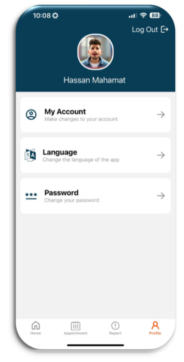

# 🏛️ Municipality Application Frontend

[](https://reactnative.dev/)
[](https://expo.dev/)
[](https://www.typescriptlang.org/)
[](LICENSE)

A comprehensive **Municipality Management System** mobile application built with React Native and Expo, providing citizens with easy access to municipal services including community management, tourism, health services, transportation, and more.

## 📋 Table of Contents

- [Features](#-features)
- [Tech Stack](#-tech-stack)
- [Screenshots](#-screenshots)
- [Prerequisites](#-prerequisites)
- [Installation](#-installation)
- [Configuration](#-configuration)
- [Running the Application](#-running-the-application)
- [Backend Integration](#-backend-integration)
- [Testing](#-testing)
- [Project Structure](#-project-structure)
- [API Documentation](#-api-documentation)
- [Internationalization](#-internationalization)
- [Security](#-security)
- [Contributing](#-contributing)
- [Authors](#-authors)
- [License](#-license)

## ✨ Features

### 🔐 Authentication & User Management

- **Secure Login/Registration** with email and password
- **Google OAuth Integration** for seamless authentication
- **Password Reset** functionality with email verification
- **JWT Token Management** with automatic refresh
- **User Profile Management** with avatar generation

### 🏥 Health Services

- **Hospital Directory** with search and location services
- **Pharmacy Locator** with operating hours and contact information
- **Interactive Maps** with directions and location services
- **Real-time Availability** status for medical facilities

### 🚌 Transportation Services

- **Bus Route Tracking** with real-time updates
- **Bus Station Information** with schedules and routes
- **Vehicle Collection Services** for municipal vehicles
- **Interactive Route Maps** with navigation

### 🏘️ Community Services

- **Emergency Contacts** with direct calling functionality
- **Waste Collection** schedules and guidelines
- **Animal Shelter** services and reporting
- **Disaster Gathering Points** with safety information
- **Community Events** management and participation

### 🏛️ Municipal Services

- **Department Directory** with contact information
- **Service Requests** submission and tracking
- **Municipal History** and information
- **Contact Information** for all departments
- **Announcements** and public notices

### 🏖️ Tourism Services

- **Historical Places** with detailed information and photos
- **Restaurant Directory** with reviews and ratings
- **Payment Points** for municipal services
- **Tourist Information** and guides
- **Interactive Comments** and recommendations

### 📅 Appointment System

- **Service Appointments** booking and management
- **Appointment History** and status tracking
- **Available Time Slots** with real-time updates
- **Reminder Notifications** for upcoming appointments

### 📱 Additional Features

- **Multi-language Support** (English & Turkish)
- **Push Notifications** for important updates
- **Offline Capability** for essential services
- **Image Upload** for reports and requests
- **Real-time Comments** and feedback system
- **Responsive Design** for all screen sizes

## 🛠️ Tech Stack

### Core Technologies

- **[React Native](https://reactnative.dev/)** (v0.76.6) - Cross-platform mobile development
- **[Expo](https://expo.dev/)** (v52.0.25) - Development platform and tools
- **[TypeScript](https://www.typescriptlang.org/)** (v5.3.3) - Type-safe JavaScript
- **[Expo Router](https://expo.github.io/router/)** (v4.0.16) - File-based routing

### State Management & Data Fetching

- **[React Query](https://tanstack.com/query/latest)** (v5.51.23) - Server state management
- **[React Hook Form](https://react-hook-form.com/)** (v7.52.2) - Form handling
- **[Zod](https://zod.dev/)** (v3.23.8) - Schema validation

### UI & Styling

- **[NativeWind](https://nativewind.dev/)** (v2.0.11) - Tailwind CSS for React Native
- **[React Native Paper](https://callstack.github.io/react-native-paper/)** (v5.12.5) - Material Design components
- **[Expo Vector Icons](https://docs.expo.dev/guides/icons/)** (v14.0.2) - Icon library
- **[React Native Reanimated](https://docs.swmansion.com/react-native-reanimated/)** (v3.16.1) - Animations

### Navigation & UI Components

- **[React Navigation](https://reactnavigation.org/)** (v7.0.0) - Navigation library
- **[Bottom Sheet](https://gorhom.github.io/react-native-bottom-sheet/)** (v4.6.4) - Modal components
- **[Keyboard Aware Scroll View](https://github.com/APSL/react-native-keyboard-aware-scroll-view)** (v0.9.5) - Keyboard handling

### Authentication & Backend

- **[Firebase](https://firebase.google.com/)** (v11.0.2) - Backend services
- **[React Native Firebase](https://rnfirebase.io/)** (v23.0.0) - Firebase SDK
- **[Axios](https://axios-http.com/)** (v1.7.4) - HTTP client

### Internationalization

- **[i18next](https://www.i18next.com/)** (v23.12.2) - Internationalization framework
- **[React i18next](https://react.i18next.com/)** (v15.0.0) - React integration

### Development Tools

- **[ESLint](https://eslint.org/)** - Code linting
- **[Prettier](https://prettier.io/)** - Code formatting
- **[Jest](https://jestjs.io/)** (v29.7.0) - Testing framework
- **[Expo CLI](https://docs.expo.dev/workflow/expo-cli/)** - Development tools

## 📱 Screenshots

### Authentication & User Management


### Main Dashboard & Services




### Health Services


### Transportation Services


### Community Services


### Municipal Services


### Tourism Services


### Appointment System


_Note: Screenshots do not cover the entire project. You should run the applicaion to all the UI._

## ⚙️ Prerequisites

Before running this application, make sure you have the following installed:

- **Node.js** (v18.0.0 or higher)
- **npm** (v9.0.0 or higher) or **yarn** (v1.22.0 or higher)
- **Expo CLI** (v6.0.0 or higher)
- **Git** (for version control)
- **Android Studio** (for Android development)
- **Xcode** (for iOS development, macOS only)

### Mobile Development Setup

- **Android SDK** (API level 21 or higher)
- **iOS Simulator** (for iOS development)
- **Physical device** or **emulator** for testing

## 🚀 Installation

### 1. Clone the Repository

```bash
git clone https://github.com/Hassan-Mahadjir/Municipality-app-frontend.git
cd Municipality-app-frontend
```

### 2. Install Dependencies

```bash
npm install
# or
yarn install
```

### 3. Install Expo CLI (if not already installed)

```bash
npm install -g @expo/cli
# or
yarn global add @expo/cli
```

### 4. Set up Environment Variables

Create a `.env` file in the root directory:

```bash
cp .env.example .env
```

Configure your environment variables in `.env`:

```env
# API Configuration
API_BASE_URL=http://192.168.3.143:3000
API_TIMEOUT=10000

# Firebase Configuration
FIREBASE_API_KEY=your-firebase-api-key
FIREBASE_AUTH_DOMAIN=your-project.firebaseapp.com
FIREBASE_PROJECT_ID=your-project-id
FIREBASE_STORAGE_BUCKET=your-project.appspot.com
FIREBASE_MESSAGING_SENDER_ID=your-sender-id
FIREBASE_APP_ID=your-app-id

# Google OAuth
GOOGLE_CLIENT_ID=your-google-client-id
GOOGLE_CLIENT_ID_IOS=your-google-ios-client-id
GOOGLE_CLIENT_ID_ANDROID=your-google-android-client-id

# App Configuration
APP_NAME=Municipality Application
APP_VERSION=1.0.0
```

## ⚙️ Configuration

### Firebase Setup

1. **Create a Firebase Project**

   - Go to [Firebase Console](https://console.firebase.google.com/)
   - Create a new project or select existing one
   - Enable Authentication, Firestore, and Storage

2. **Configure Authentication**

   - Enable Email/Password authentication
   - Enable Google Sign-In
   - Add your app's SHA-1 fingerprint for Android

3. **Download Configuration Files**
   - Download `google-services.json` for Android
   - Download `GoogleService-Info.plist` for iOS
   - Place them in the project root

### Google OAuth Setup

1. **Google Cloud Console Configuration**

   - Go to [Google Cloud Console](https://console.cloud.google.com/)
   - Create OAuth 2.0 credentials
   - Add authorized redirect URIs:
     - `myapp://home` (Mobile)
     - `http://localhost:3000/auth/google/callback` (Web)

2. **Configure OAuth in App**
   - Update Google Client IDs in environment variables
   - Configure platform-specific settings

## 🏃‍♂️ Running the Application

### Development Mode

```bash
# Start the development server
npm start
# or
yarn start
# or
expo start
```

### Platform-Specific Commands

```bash
# Run on Android
npm run android
# or
expo run:android

# Run on iOS
npm run ios
# or
expo run:ios

# Run on Web
npm run web
# or
expo start --web
```

### Debug Mode

```bash
# Start with debugging enabled
npm run start:debug
```

## 🔗 Backend Integration

This frontend application is designed to work with the [Municipality Application Backend](https://github.com/Hassan-Mahadjir/Municipality-app-backend), a NestJS-based API.

### Backend Setup

1. **Clone the Backend Repository**

```bash
git clone https://github.com/Hassan-Mahadjir/Municipality-app-backend.git
cd Municipality-app-backend
```

2. **Install Backend Dependencies**

```bash
npm install
```

3. **Configure Backend Environment**

```bash
cp .env.example .env
```

4. **Set up Database**

```bash
# Create PostgreSQL database
CREATE DATABASE municipality_db;

# Run migrations
npm run migration:run
```

5. **Start Backend Server**

```bash
# Development mode
npm run start:dev

# Production mode
npm run build
npm run start:prod
```

### API Configuration

Update the API base URL in `src/services/api/http.ts`:

```typescript
const http = axios.create({
	baseURL: 'http://your-backend-ip:3000', // Update this URL
	headers: {
		Accept: 'application/json',
		'Content-Type': 'application/json',
	},
});
```

### Network Configuration

For development on physical devices:

- Ensure both frontend and backend are on the same network
- Update the API base URL to your computer's local IP address
- Configure CORS settings in the backend if needed

## 🧪 Testing

### Run Tests

```bash
# Unit tests
npm test

# Test coverage
npm run test:cov

# Test in watch mode
npm run test:watch

# E2E tests
npm run test:e2e
```

### Test Structure

```
src/
├── __tests__/
│   ├── components/
│   ├── services/
│   └── utils/
```

## 📁 Project Structure

```
src/
├── app/                    # Expo Router pages
│   ├── (auth)/            # Authentication screens
│   │   ├── index.tsx      # Login screen
│   │   ├── signUp.tsx     # Registration screen
│   │   └── password/      # Password reset flow
│   ├── (user)/            # Main app screens
│   │   ├── home/          # Home and service categories
│   │   │   ├── (community)/    # Community services
│   │   │   ├── (health)/       # Health services
│   │   │   ├── (municipality)/ # Municipal services
│   │   │   ├── (news)/         # News and announcements
│   │   │   ├── (tourism)/      # Tourism services
│   │   │   └── (traffic)/      # Transportation services
│   │   ├── appointment/   # Appointment management
│   │   ├── profile/       # User profile
│   │   └── report/        # Service reports
│   └── _layout.tsx        # Root layout
├── components/            # Reusable components
│   ├── services/          # Service-specific components
│   ├── profile/           # Profile components
│   ├── report/            # Report components
│   └── common/            # Common UI components
├── services/              # API services and business logic
│   ├── api/               # API endpoints
│   └── *.service.ts       # Service modules
├── types/                 # TypeScript type definitions
├── constants/             # App constants and configuration
├── hooks/                 # Custom React hooks
├── utils/                 # Utility functions
├── styles/                # Style definitions
├── i18n/                  # Internationalization
│   └── translation/       # Translation files
├── assets/                # Static assets
│   ├── images/            # Images and icons
│   └── data/              # Static data files
└── providers/             # Context providers
```

## 📚 API Documentation

The application integrates with the following API endpoints:

### Authentication

- `POST /auth/login` - User login
- `POST /auth/refresh` - Refresh JWT token
- `POST /auth/signout` - User logout
- `GET /auth/google/login` - Google OAuth login
- `PUT /auth/change-password` - Change password
- `POST /auth/send-code-email` - Send reset code
- `POST /auth/reset-password` - Reset password

### User Management

- `POST /user` - Create user
- `GET /user/:id` - Get user by ID
- `PATCH /user/:id` - Update user
- `DELETE /user/:id` - Delete user

### Health Services

- `GET /health/hospitals` - Get hospitals
- `POST /health/hospitals` - Create hospital
- `GET /health/pharmacies` - Get pharmacies
- `POST /health/pharmacies` - Create pharmacy

### Transportation

- `GET /bus/lines` - Get bus lines
- `POST /bus/lines` - Create bus line
- `GET /bus/stations` - Get stations
- `GET /bus/schedules` - Get schedules

### Community Services

- `GET /community/emergency-contact` - Get emergency contacts
- `POST /community/waste-type` - Create waste type
- `GET /community/waste-sechdule` - Get waste schedules
- `POST /community/animal-report` - Report animal

### Municipal Services

- `GET /department` - Get departments
- `POST /request` - Create service request
- `GET /report` - Get reports
- `POST /announcement` - Create announcement

### Tourism

- `GET /tourism/restaurants` - Get restaurants
- `POST /tourism/historical-places` - Create historical place
- `GET /tourism/payment-points` - Get payment points

## 🌍 Internationalization

The application supports multiple languages:

### Supported Languages

- **English** (en) - Default language
- **Turkish** (tr) - Secondary language

### Translation Files

- `src/i18n/translation/en.json` - English translations
- `src/i18n/translation/tr.json` - Turkish translations

### Adding New Languages

1. Create a new translation file in `src/i18n/translation/`
2. Add the language to the language detector
3. Update the language picker component

### Usage in Components

```typescript
import { useTranslation } from 'react-i18next';

const MyComponent = () => {
	const { t } = useTranslation();

	return <Text>{t('welcomeMessage')}</Text>;
};
```

## 🔒 Security

### Security Features

- **JWT token-based authentication**
- **Secure password hashing**
- **Input validation and sanitization**
- **HTTPS enforcement**
- **Token refresh mechanism**
- **Secure storage for sensitive data**

### Security Best Practices

- All API calls use HTTPS
- JWT tokens are stored securely
- Input validation on all forms
- Error handling without exposing sensitive information
- Regular dependency updates for security patches

## 🤝 Contributing

We welcome contributions! Please follow these steps:

### Development Setup

1. **Fork the repository**
2. **Create a feature branch**

```bash
git checkout -b feature/amazing-feature
```

3. **Install dependencies**

```bash
npm install
```

4. **Make your changes**
5. **Run tests**

```bash
npm test
```

6. **Commit your changes**

```bash
git commit -m 'Add some amazing feature'
```

7. **Push to the branch**

```bash
git push origin feature/amazing-feature
```

8. **Open a Pull Request**

### Development Guidelines

- Follow TypeScript best practices
- Write comprehensive tests
- Update documentation
- Follow the existing code style
- Ensure all tests pass
- Use conventional commit messages

### Code Style

- Use TypeScript for type safety
- Follow ESLint and Prettier configurations
- Use functional components with hooks
- Implement proper error handling
- Write meaningful component and function names

## 👨‍💻 Authors

**Graduation Project Team**

### Team Members

- **Hassan Mahadjir** - [@hassan-mahadjir](https://github.com/hassan-mahadjir)

  - Full Stack Developer
  - Frontend & Backend Development
  - Project Lead & Documentation

- **Nour Barakat** - [@nour-barakat](https://github.com/nour-barakat)

  - Full Stack Developer
  - UI/UX Design
  - Testing

- **Ayesha Atif** - [@Aysha-atif]

  - UI/UX Design
  - Frontend Developer

- **Melisa Mehrübeoğlu** - [@Melisa-Mehrübeoğlu]
  - UI/UX Design
  - Frontend Developer

### Contact Information

- **Email**: hm.mahadjir@gmail.com
- **Project Repository**: [Municipality Application Frontend](https://github.com/Hassan-Mahadjir/Municipality-app-frontend)
- **Backend Repository**: [Municipality Application Backend](https://github.com/Hassan-Mahadjir/Municipality-app-backend)

## 📄 License

This project is licensed under the **MIT License** - see the [LICENSE](LICENSE) file for details.

## 🙏 Acknowledgments

- **Expo Team** for the amazing development platform
- **React Native Team** for the cross-platform framework
- **NestJS Team** for the backend framework
- **Firebase Team** for the backend services
- **All contributors** and maintainers
- **Eastern Mediterranean University** for academic support

---

**Made with ❤️ for better municipal services**

_This project was developed as a graduation project at Eastern Mediterranean University, demonstrating modern mobile application development practices and real-world problem-solving skills._
